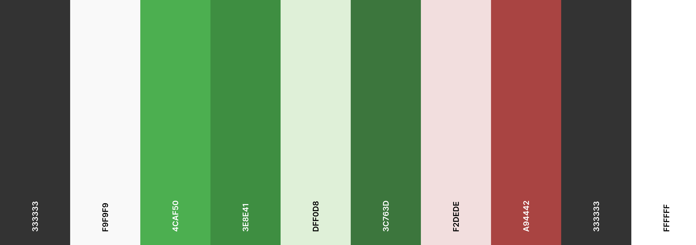
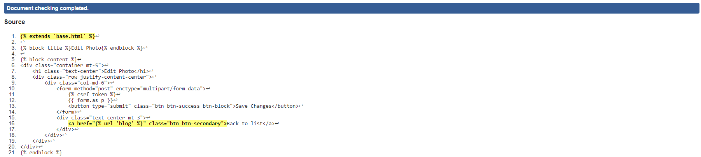
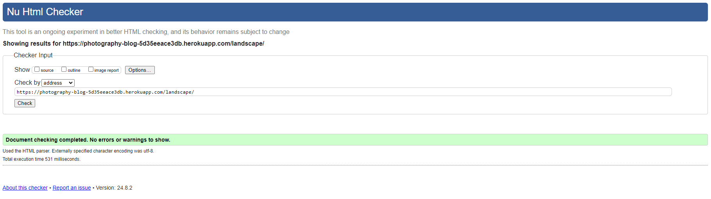
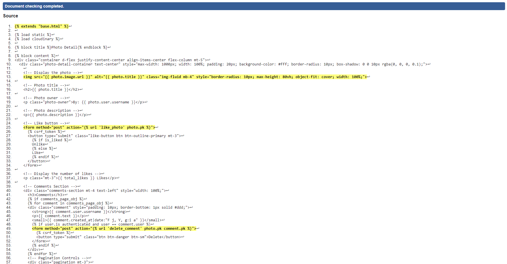
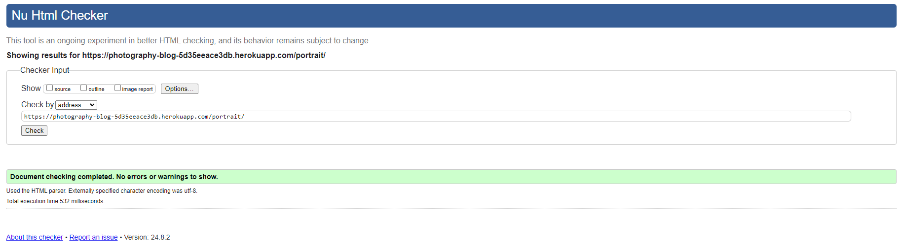
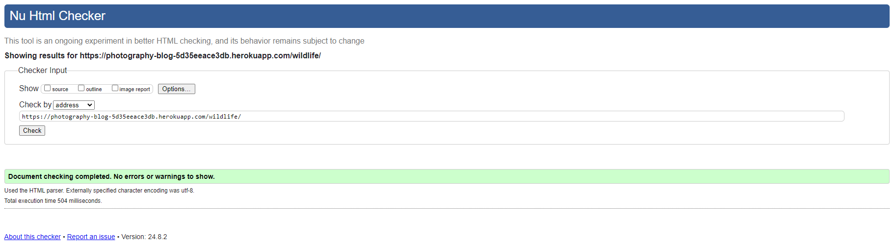
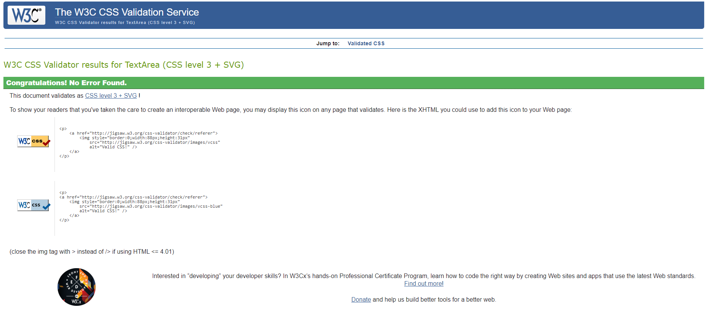

# Photography Blog

View the live project here [Photography Blog](https://photography-blog-5d35eeace3db.herokuapp.com)

Am I Responsive
Here's deployed site: [Am I Responsive](https://ui.dev/amiresponsive?url=https://photography-blog-5d35eeace3db.herokuapp.com/)

## Introduction

Photography Blog is a dynamic web application created for photography enthusiasts who wish to showcase their work and connect with a community of like-minded individuals. This platform allows users to upload their photos, categorize them, and engage with others through comments and likes. Whether you’re an amateur photographer or a seasoned professional, the Photography Blog offers a space to share your visual stories with the world.

## Project Overview

Photography Blog is a web application designed for photographers to share their work with a community. Users can upload photos, categorize them, leave comments, and interact with others by liking photos. The project emphasizes a user-friendly interface with responsive design, making it accessible on both desktop and mobile devices.

## Developer Goals
The primary goals for the development of the Photography Blog are:

1. Create an Intuitive User Interface: Develop a user-friendly and responsive interface that allows users to easily navigate the site, upload photos, and interact with other users.
2. Implement Robust User Authentication: Ensure that user data is securely handled with proper authentication mechanisms, allowing users to manage their profiles and content.
3. Enable Content Management: Provide users with the ability to upload, edit, and delete their photos, as well as categorize them for better organization and discovery.
4. Foster Community Interaction: Encourage user engagement through features like comments and likes, creating a social environment around photography.
5. Ensure Mobile Responsiveness: Design the site to be fully responsive, ensuring a seamless experience on devices of all sizes, from desktops to smartphones.
6. Utilize Cloud Storage for Media: Integrate cloud storage solutions to efficiently manage and serve images, optimizing performance and scalability.
7. Provide Comprehensive Error Handling: Implement custom error pages to handle common HTTP errors gracefully, improving the user experience even when things go wrong.

## User Goals
For users, the Photography Blog aims to fulfill the following goals:

1. Easily Share Photography: Users should be able to effortlessly upload and categorize their photos, making them accessible to others.
2. Engage with the Community: Users should be able to interact with other photographers through comments and likes, building a sense of community.
3. Explore a Wide Range of Photography: The platform should provide an easy way to browse and discover photos across different categories, helping users to find inspiration and new connections.
4. Manage Personal Content: Users should have control over their own content, with the ability to edit or delete their photos and manage their profile settings.
5. Access from Any Device: Users should enjoy a consistent and intuitive experience across all devices, whether they are on a desktop or mobile device.
6. Search for Specific Content: The platform should offer a search feature that allows users to quickly find photos or posts that match their interests.
7. Secure and Private Experience: Users should feel confident that their personal information is secure, and that they have privacy controls over their content.

## Problem Statement
### Background
Photography is a powerful medium for storytelling, yet existing platforms often fail to provide photographers with the tailored experience they need. General social media sites overwhelm quality content with sheer volume, making it difficult for photographers to stand out and connect meaningfully with their audience.

### Problem
Photographers face several challenges on current platforms:

- Lack of Niche Communities: General platforms don’t offer specialized spaces for photographers.
- Content Overload: Quality work often gets lost in a sea of posts.
- Limited Content Control: Users need better tools to manage and showcase their work.
- Poor Engagement: Existing interaction tools are often inadequate for meaningful feedback.
- Mobile Responsiveness Issues: Many platforms fail to provide a consistent visual experience across devices.

### Requirements
To address these challenges, the Photography Blog must:

- Offer User-Friendly Design: Easy navigation and content management.
- Encourage Engagement: Features like comments, likes, and search to enhance interaction.
- Ensure Responsiveness: Consistent design across all devices.
- Provide Secure Authentication: Protect user data and content.
- Foster Community Building: Tools that promote connections among photographers.

### Target Audience
This platform is designed for:

- Amateur Photographers: Looking to share and improve their skills.
- Professional Photographers: Seeking to showcase their portfolios and connect with peers.
- Photography Enthusiasts: Interested in exploring and engaging with visual content.
- Content Creators: Searching for a dedicated space to share high-quality photography.
- Art Directors & Agencies: Looking for new talent and inspiration.

## Entity-Relationship Diagram (ERD)
The Entity-Relationship Diagram (ERD) representing the relationships between the User, Category, Photo and Comment models.

- User to Photo: A one to many relationship where a user can upload many photos.
- Category to Photo: A one to many relationship where each photo belongs to one category.
- Photo to Comment: A one to many relationship where a photo can have many comments.
- User to Comment: A one to many relationship where a user can make many comments.
- User to Photo (Likes): A many to many relationship where users can like many photos, and each photo can be liked by many users.

# Learning Outcomes
1. ## Django Framework Proficiency:

- Develop a strong command of Django, a high-level Python web framework, by understanding its architecture, core components, and best practices for building robust, scalable web applications.

2. ## Bootstrap Integration:

- The integration of Bootstrap into Django projects to create responsive, mobile-first web designs efficiently, enhancing both the aesthetic appeal and user experience.

3. ## Python Programming Skills:

- Improve Python programming skills, with a focus on writing clean, efficient, and maintainable code that seamlessly integrates with Django’s architecture.

4. ## Image Handling with Pillow and Cloudinary:

- Learn to install and use Pillow, a powerful Python Imaging Library, to handle image processing tasks like uploading and resizing.
- Gain proficiency in integrating Cloudinary, a cloud-based service, to efficiently manage image storage, processing, and delivery. Leverage its APIs for advanced image optimization and manipulation.

5. ## CRUD Operations:

- The implementation of Create, Read, Update, and Delete (CRUD) operations in Django, enabling full management of data models and enhancing dynamic content interaction.
- Learn to build views and templates to handle these operations efficiently and securely.

6. ## User Authentication and Authorization:

- Gain expertise in implementing user authentication and authorization mechanisms in Django, ensuring secure access control for different parts of the application.
- Learn to integrate Django’s built-in authentication system to manage user login, registration, password management, and permission settings.

7. ## Template Rendering and Static Files Management:

- Understand Django’s template engine and how to create dynamic HTML templates that render data seamlessly from the backend.
- Learn to manage static files (CSS, JavaScript, images) in Django, ensuring efficient loading and organisation, particularly in production environments.

8. ## Javascript Integration and Engancement
- Develop JavaScript skills to enhance interactivity and user experience in Django applications.
- Learn to write custom JavaScript code for dynamic features such as search bars, toggle and dropdown.

# User Experience (UX)

The goal of this project is to create a seamless and enjoyable user experience for amateur photographers. The blog is designed to be intuitive, visually appealing, and functional, ensuring users can easily navigate the site, upload their work, and engage with the community.

# User Stories
1. As a Site User I can view a paginated list of posts so that easily select a post to view.
2. As a Site User / Admin I can view the number of likes on each post so that I can see which is the most popular or viral.
3. As a Site User, I want to log in, so that I can access my account and manage my posts.
4. As a Site User, I want to upload photos, so that I can share my work with others.
5. As a Site User, I want to edit or delete my posts, so that I can manage my portfolio.
6. As a Site User, I want to comment on posts, so that I can provide feedback and engage with the community.
7. As a Site User, I want to log out, so that I can securely leave the site.

and more. [Link to the Kanban board here](https://github.com/users/trxdave/projects/6)

# Development Plan

This project was organized and executed using Agile methodology. A Kanban board within GitHub Projects was utilized to track progress and manage tasks, ensuring a structured and iterative development process. [Link to the Kanban board here](https://github.com/users/trxdave/projects/6)

# Features

## User Authentication
- Sign Up: New users can create an account.
- Login/Logout: Users can log in and out securely.
- Profile Management: Users can manage their profile and view their uploaded photos.

## Photo Management
- Upload Photos: Users can upload photos with titles, descriptions, and categorise them.
- Edit/Delete Photos: Users can edit or delete their photos.
- Photo Gallery: Users can browse through all photos uploaded by others.
- Like Photos: Users can like or unlike Photos.
- View Photo Details: Clicking on a photo displays a detailed view with the photo, title, description, likes, and comments.

## Comments
- Comment on Photos: Users can leave comments on photos.
- Delete Comments: Users can delete their comments.

## Search Functionality
- Search Bar: Users can search for photos by title or content directly from the navbar.

## Pagination
- Paginated Views: The photo gallery and comments are paginated for easy navigation.

## Responsive Design
- Mobile Friendly: The site is fully responsive, ensuring a seamless experience on mobile devices.

## Error Handling
- Custom Error Pages: The site includes custom error pages for 404, 500, 403 and 400 errors.

# Model Design

## Design
The design of the Photography Blog is modern and minimalist, with a focus on showcasing high-quality images. The layout is clean and simple, with ample whitespace to create a visually appealing experience for users. The color scheme is a combination of neutral tones, with accents of blue to evoke a sense of creativity and inspiration.

## Design Choices
The design choices were influenced by the need to create a platform that is easy to navigate and visually appealing. The use of a minimalist layout and neutral color scheme allows the focus to be on the photography, while the accents of blue add a touch of personality to the design.

## Colours
The colors used in the design are:

- Primary Text Color: #333 - Used for the main text across the website.
- Background Color: #f9f9f9 - Used for the overall background of the site and form backgrounds.
- Header Background Color: #333 - Used for the header and other key areas, providing a dark contrast.
- Button Primary Color: #4CAF50 - Used for primary action buttons, such as submit and upload.
- Button Hover Color: #3e8e41 - The hover state for primary buttons, creating an interactive feel.
- Alert Success Background: #dff0d8 - Used for success messages, like after form submissions.
- Alert Success Text: #3c763d - Text color for success alerts.
- Alert Danger Background: #f2dede - Used for error or danger messages.
- Alert Danger Text: #a94442 - Text color for error alerts.
- Footer Background Color: #333 - Provides a dark footer with contrasting white text.
- Footer Text and Icon Color: #fff - Ensures good readability against the dark background.

## Fonts
The fonts used in your project are:

Arial, sans-serif: This is the main font used throughout your CSS for body text and headings. It's a widely used, clean, and highly readable font that is supported across all browsers and devices.

# Wireframes

- Wireframes were created to visualize the layout and design of the photography blog.

# Testing

## Validator Testing

### HTML Validation
ll pages were validated, and the code was pasted in. A filter was applied to remove issues related to the Django templating system. 

| **Tested** | **Result** | **View Result** | **Pass** |
--- | --- | --- | :---:
|base| No errors | 

Screenshot of result

| :white_check_mark:|
|about| No errors | 

Screenshot of result

| :white_check_mark:|
|add photo | No errors | 

Screenshot of result

| :white_check_mark:|
|blog| No errors | 

Screenshot of result

| :white_check_mark:|
|confirm delete| No errors | 

Screenshot of result

| :white_check_mark:|
|contact| No errors | 

Screenshot of result

| :white_check_mark:|
|edit photo| No errors | 

Screenshot of result

| :white_check_mark:|
|homepage| No errors | 

Screenshot of result

| :white_check_mark:|
|landscape| No errors | 

Screenshot of result

| :white_check_mark:|
|marco| No errors | 

Screenshot of result

| :white_check_mark:|
|photo detail| No errors | 

Screenshot of result
 
| :white_check_mark:|
|photo list| No errors | 

Screenshot of result
 
| :white_check_mark:|
|portrait| No errors | 

Screenshot of result

| :white_check_mark:|
|search results| No errors | 

Screenshot of result

| :white_check_mark:|
|street| No errors | 

Screenshot of result

| :white_check_mark:|
|wildlife| No errors | 

Screenshot of result
 
| :white_check_mark:|

### CSS Validation

| **Tested** | **Result** | **View Result** | **Pass** |
--- | --- | --- | :---:
|styles.css | No errors |

Screenshot of result

| :white_check_mark:|

## Performance and Accessibility

# Technologies Used

- HTML: Used for structuring the content on the web pages. It forms the backbone of the project, ensuring that all elements are correctly placed and accessible.

- CSS: Used for styling the HTML elements, providing the visual appearance and layout of the web pages. CSS ensures the platform is visually appealing and user-friendly.

- JavaScript: Adds interactivity and dynamic behavior to the web pages. It enhances the user experience by allowing for real-time updates, form validations, and interactive elements.

- Python: a primary programming language for the backend of the project. It is used in conjunction with the Django framework to handle server-side logic, data processing, and integration with the database.

## Tools

## Frameworks - Libraries - Programs Used

1. Django
Purpose: A high-level Python web framework that encourages rapid development and clean, pragmatic design.
Use Case: Used for building the backend, managing databases, handling user authentication, and rendering templates.

2. Bootstrap
Purpose: A popular front-end framework for developing responsive, mobile-first websites.
Use Case: Used for styling the website, creating responsive layouts, and ensuring a consistent design across devices.

3. Cloudinary API
Purpose: A cloud-based image and video management service.
Use Case: Used for handling image uploads, storage, and optimization, ensuring fast and reliable content delivery.

4. Pillow
Purpose: A Python Imaging Library that adds image processing capabilities to your Python interpreter.
Use Case: Used to manage and process image uploads, including resizing and format conversions.

5. JavaScript
Purpose: A programming language that enables dynamic content on web pages.
Use Case: Used for front-end interactions such as the search bar functionality, dropdowns, and form validations.

6. GitHub
Purpose: A platform for version control and collaborative development.
Use Case: Used to host the project repository, manage version control with Git, and collaborate through issues and pull requests.

7. JQuery
Purpose: A fast, small, and feature-rich JavaScript library.
Use Case: Used to simplify HTML document traversal and manipulation, event handling, and animation.

8. SQLite
Purpose: A lightweight, disk-based database that doesn’t require a separate server process.
Use Case: Used as the database for storing all application data during development.

9. Chrome DevTools
Purpose: A set of web developer tools built directly into the Google Chrome browser.
Use Case: Used for debugging JavaScript, analyzing runtime performance, and optimizing website responsiveness.

10. Balsamiq
Purpose: A wireframing tool that allows designers to create sketches of their web pages or applications.
Use Case: Used for creating wireframes and mockups to plan the layout and design of the website before development.

11. Responsive Design Mode
Purpose: A browser tool that allows developers to view their website on different screen sizes and resolutions.
Use Case: Used to test and ensure the website is responsive across a range of devices, including mobile phones and tablets.

12. Coolors.co
Purpose: An online tool for generating color palettes.
Use Case: Used to select and create the color scheme for the website, ensuring a visually appealing design.

13. StartBootstrap.com
Purpose: A website offering free and premium Bootstrap themes and templates.
Use Case: Used as a resource for finding Bootstrap templates and inspiration for the website’s design.

14. Heroku
Purpose: Used to deploy the Django application.
Use Case: Heroku is a cloud platform that lets companies build, deliver, monitor, and scale apps.

# Future Plans

1. Enhanced User Profiles
- Description: Develop detailed user profiles where photographers can showcase their portfolios and follow others.
- Objective: To create a more personalized and interactive community experience.

2. Advanced Search and Filtering
- Description: Implement advanced search options based on categories and tags to help users find specific content easily.
- Objective: To improve content discoverability and user experience.

3. Mobile App Development
- Description: Create a mobile app for Android and iOS to allow users to access and upload content on the go.
- Objective: To increase accessibility and engagement with a mobile-friendly solution.

4. Social Media Integration
- Description: Add features that allow users to share their photos directly to social media platforms like Instagram and Facebook.
- Objective: To broaden the reach of shared content and attract more users.

5. Photography Challenges
- Description: Organize photography challenges to engage the community and showcase talent.
- Objective: To increase user participation and foster a vibrant community atmosphere.

# Bugs

# Heroku Deployment

This project uses [Heroku](https://www.heroku.com), a platform as a service (PaaS) that enables developers to build, run, and operate applications entirely in the cloud.

Deployment steps are as follows, after account setup:

- Select **New** in the top-right corner of your Heroku Dashboard, and select **Create new app** from the dropdown menu.
- Your app name must be unique, and then choose a region closest to you (EU or USA), and finally, select **Create App**.
- From the new app **Settings**, click **Reveal Config Vars**, and set the value of KEY to `PORT`, and the value to `8000` then select *add*.
- Further down, to support dependencies, select **Add Buildpack**.
- The order of the buildpacks is important, select `Python` first, then `Node.js` second. (if they are not in this order, you can drag them to rearrange them)

Heroku needs three additional files in order to deploy properly.

- requirements.txt
- Procfile

You can install this project's **requirements** (where applicable) using:

- `pip3 install requirements.txt`

If you have your own packages that have been installed, then the requirements file needs updated using:

- `pip3 freeze > requirements.txt`

The **Procfile** can be created with the following command:

- `echo web: node index.js > Procfile`

# Local Deployment #

This project can be cloned or forked in order to make a local copy on your own system.

For either method, you will need to install any applicable packages found within the *requirements.txt* file.

- `pip3 install -r requirements.txt`.

# Credits
* [Man standing on rock formation](<documentation/images/hero-image.jpg>)
* [Black and silver DSLR lens](<documentation/images/lens.jpg>)
* [Nikon Camera](<documentation/images/nikon-camera.jpg>)
* [Inside out 'Bad Request' 400](<documentation/images/400.png>)
* [Inside out 'Forbidden' 403](<documentation/images/403.png>)
* [Inside out 'Not Found' 404](<documentation/images/404.png>)
* [Inside out 'Internal Server Error' 500](<documentation/images/500.png>)
* [Django Allauth](https://docs.allauth.org/en/latest/)
* [Django documentation](https://docs.djangoproject.com/en/5.0/)
* [Django Search Box](https://docs.djangoproject.com/en/5.0/search/?q=search+box)
* [Daisy's walkthrough](https://www.youtube.com/watch?v=sBjbty691eI&list=PLXuTq6OsqZjbCSfiLNb2f1FOs8viArjWy&index=2)
* [Build a Photographer Personal Portfolio with Django 2020](https://www.youtube.com/watch?v=EBrm7h05vbg)
* [Pillow](https://pillow.readthedocs.io/en/stable/installation.html)
* [Cloudinary](https://cloudinary.com/)

# Acknowledgements